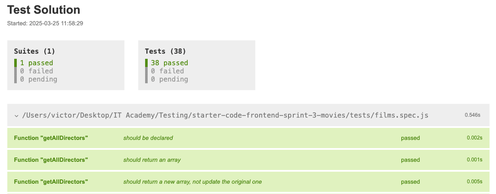

# Movie Filtering – Unit Tests



## Sprint Description

This project focuses on passing a series of **unit tests** related to movie filtering.  
You don't need to render anything on screen — your goal is to implement functions that **return the correct results** when tested.

> 💡 You’ll work with an array of movie objects and create functions to search, filter, and analyze information from it.

---

## Technologies and Tools

- **JavaScript (ES6)** using functional programming style
- **Node.js** and **CommonJS** (`require`, `module.exports`)
- **Jest** for running the unit tests
- **Recommended editor**: VS Code

---

## Prerequisites

- Basic knowledge of JavaScript
- Familiarity with array methods: `map`, `filter`, `reduce`, `sort`
- A working **Node.js** and **npm** environment

---

## Installation

1. Clone this repository:

    ```bash
    git clone https://github.com/VictorGonPe/Ecommerce.git
    cd Ecommerce
    ```

2. Install required packages:

    ```bash
    npm install
    ```

3. Make sure **Jest** is installed locally or globally:

    ```bash
    npx jest --version
    ```

---

## Run the Tests

To execute all tests once:

```bash
npm test
```

To run the test in watch mode (real-time):

```bash
npm run test:watch
```